<Tip>
	Toggle dark mode on the top right of the screen to increase the contrast of
	the background and email images.
</Tip>

## Pre Orders

### Pre Order Confirmation

-   **Context:** Email sent when a buyer places a pre-order on Ekho.
    

    	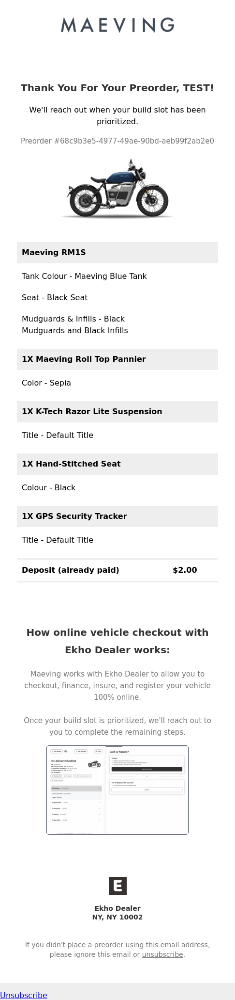
    	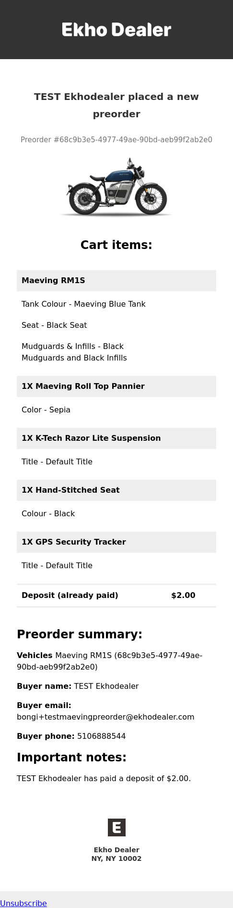
    

    

    	Images from left to right: email to buyer, email to OEM.
    

### Pre Order Refund

-   **Context:** Email sent when an OEM refunds a pre-order.
-   **Trigger:** OEM clicks 'Cancel and Refund' in the Admin Portal.

	
	

	Images from left to right: email to buyer, trigger in Admin Portal.

### Pre Order Conversion

-   **Context:** Email sent to a buyer when converting a pre-order.
-   **Trigger:** OEM clicks 'Convert Preorder' in the Admin Portal.

	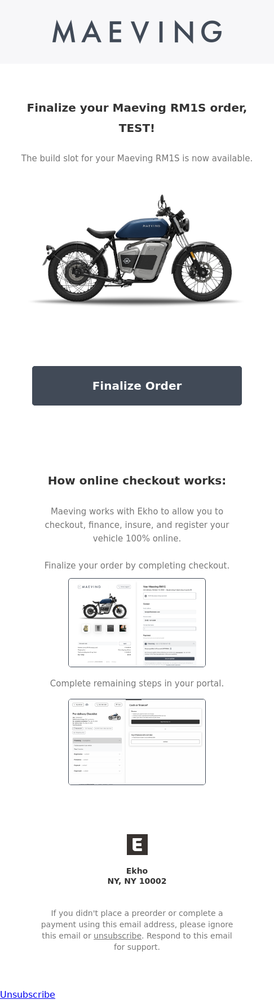
	

	Images from left to right: email to buyer, trigger in Admin Portal.

## Payments

### Full Payment Received

-   **Context:** Email sent to the buyer and OEM once an order is fully paid.
-   **Trigger:** When a cash or cashEarly ([Ekho Terminology](/essentials/ekho-terminology)) buyer pays off the remaining balance through ACH or card.
    

    	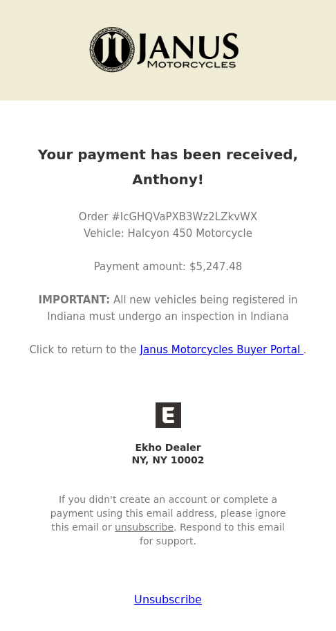
    	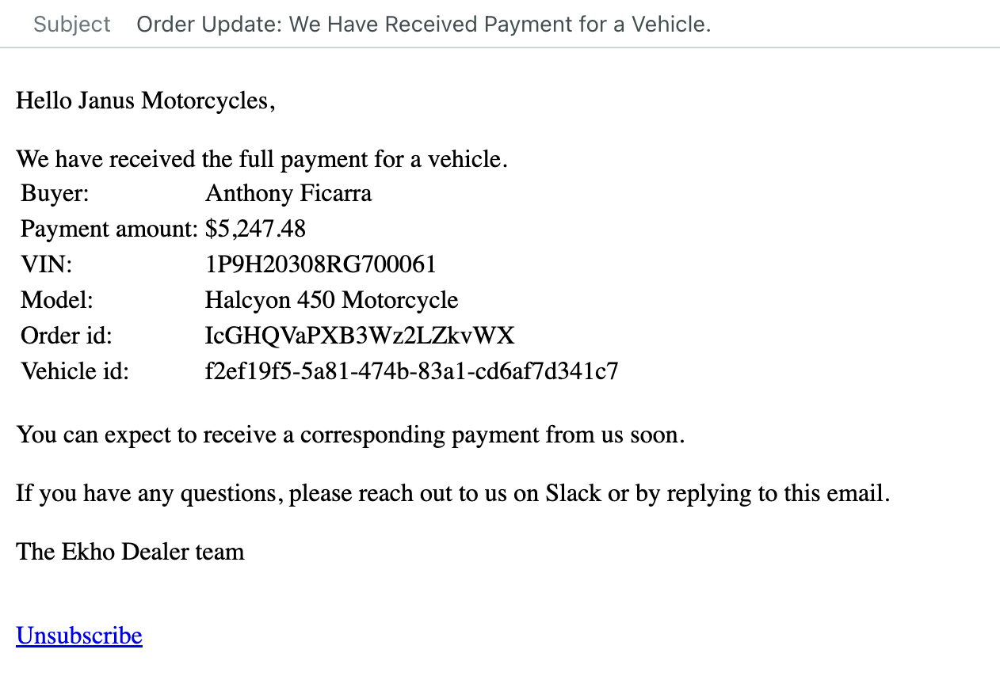
    

    

    	{' '}
    	Images from left to right: email to buyer, email sent to OEM.
    

### Lender Payment Received

-   **Context:** Email sent to the OEM when the financed amount is transferred to the OEM's Stripe account.
-   **Trigger:** When Ekho transfers the financed amount from the lender to the OEM's Stripe account for a financed order.
    

    	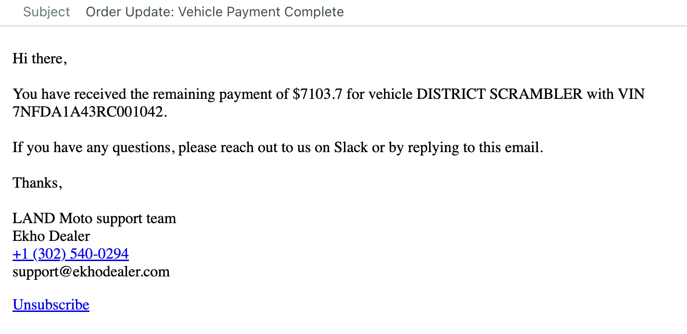
    

### ACH Payment Failed

-   **Context:** Email sent to the buyer when their ACH transfer for a down payment or remaining balance fails.
    

    	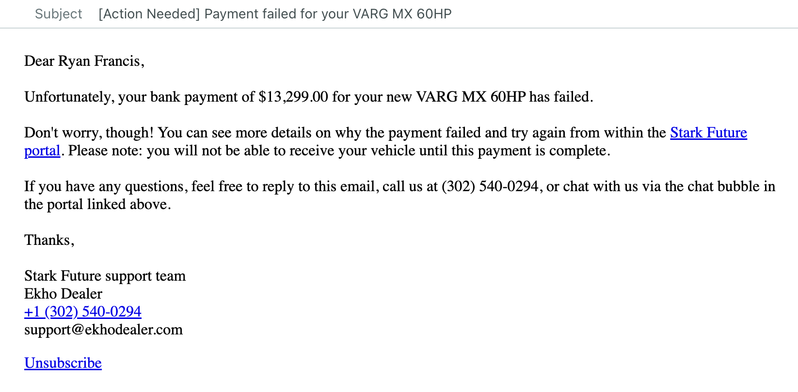
    

### Refund Initiated

-   **Context:** Email sent to the buyer when Ekho cancels and refunds their order.
-   **Trigger:** At the moment, only Ekho is able to cancel and refund an active order.
    

    	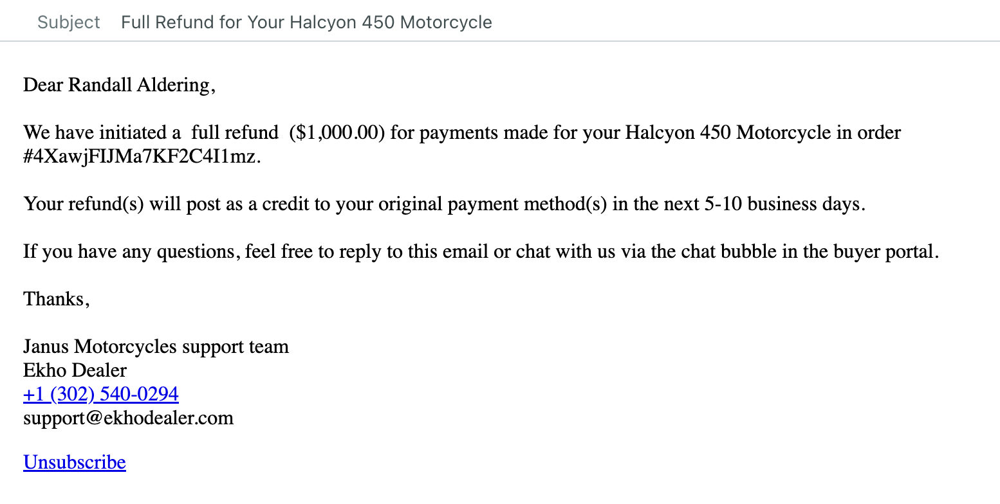
    

## Abandoned Cart Re-Engagement

-   **Context:** Email sent to the buyer if they abandoned either their pre-order or checkout session.
-   **Trigger:** Buyer inputs their contact information but does not place their order.
-   **Intervals:** Sent 1 hour after abandoning cart, 72 hours (after the first email), 120 hours (after the second email).
    -   OEMs can choose to apply a fixed discount amount upon the third and last re-engagement.

	
	
	
	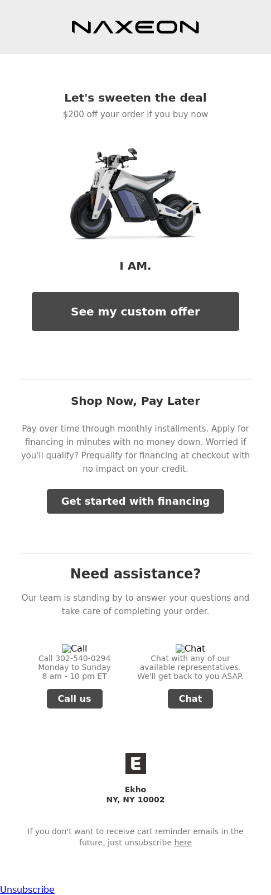

	Images from left to right: first, second, third, and third re-engagement
	with a discount.

## Checkout

### Checkout Confirmation

-   **Context:** Email sent to the buyer confirming their placed order.

    

    	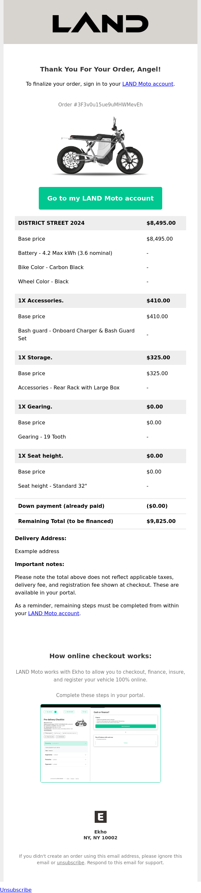
    

## Financing

### Lender's Decision

-   **Context:** Buyer receives a financing decision from the lender (either declined or approval with no stipulations).

    

    	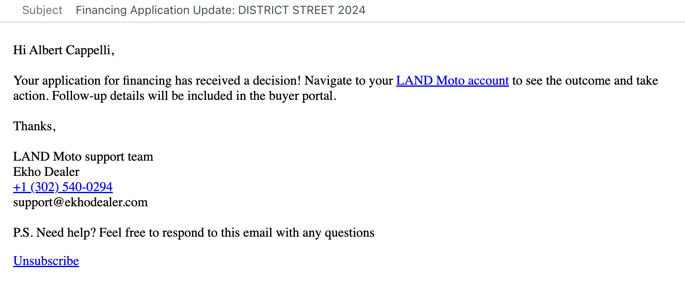
    

### Conditional Offer Received

-   **Context:** Buyer receives a conditional offer from the lender and must provide additional information to clear the stipulations.

    

    	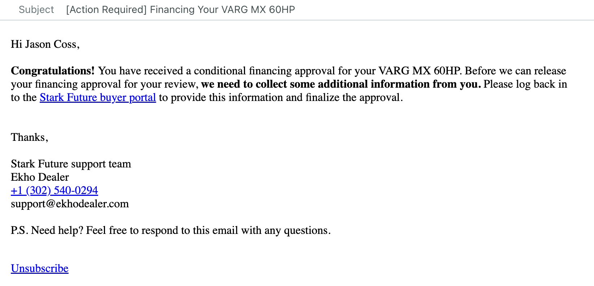
    

### Stipulations Re-requested

-   **Context:** The initial information provided was insufficient; additional information is required to clear stipulations. Ekho will provide a note with instructions or corrections.

    

    	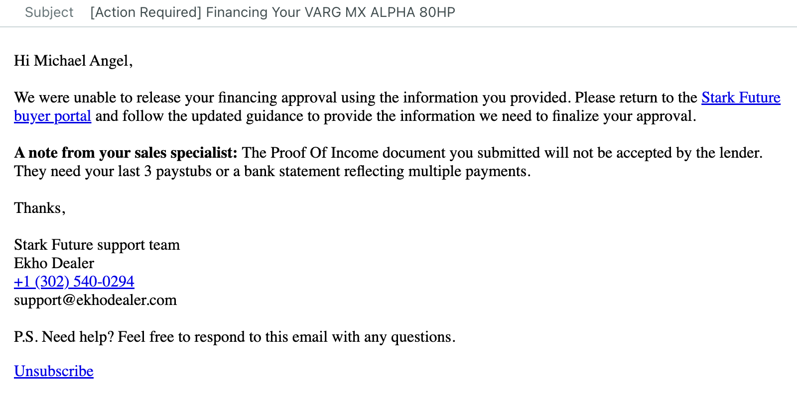
    

### Sign Final Financing Contract

-   **Context:** Buyer must sign the final financing agreement prior to delivery.
-   **Trigger:** OEM marks the vehicle as ready to ship within a week in the Admin Portal.
    

    	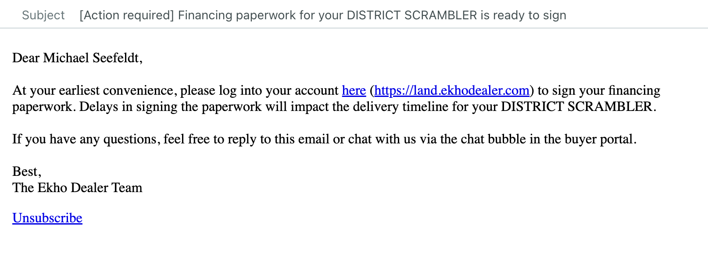
    

## Titling & Registration

### VIN Assigned

-   **Context:** Buyer was previously blocked at insurance until the VIN was assigned.
-   **Trigger:** OEM assigns the VIN for the order in the Admin Portal.
    

    	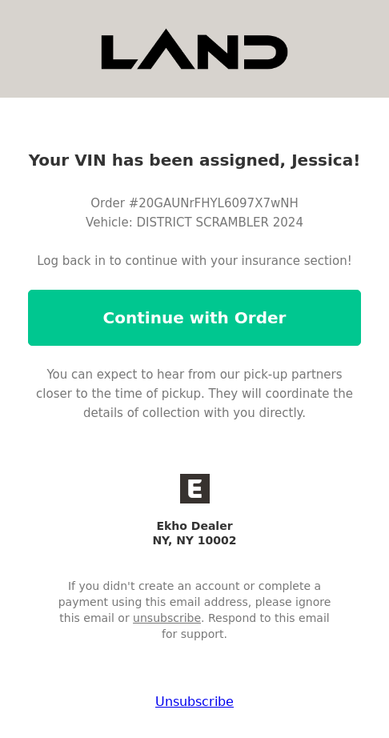
    

### Paperwork Section Ready

-   **Context:** Buyer can begin their paperwork for titling and registering their vehicle.

    

    	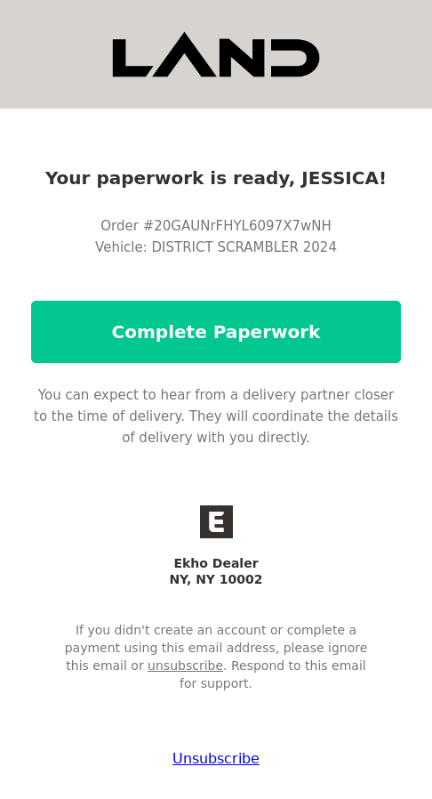
    

### Temporary Tag Uploaded

-   **Context:** Buyer can download and print their temporary tag to enjoy their vehicle upon delivery.
-   **Trigger:** OEM marks the vehicle as shipped or delivered in the Admin Portal.
    

    	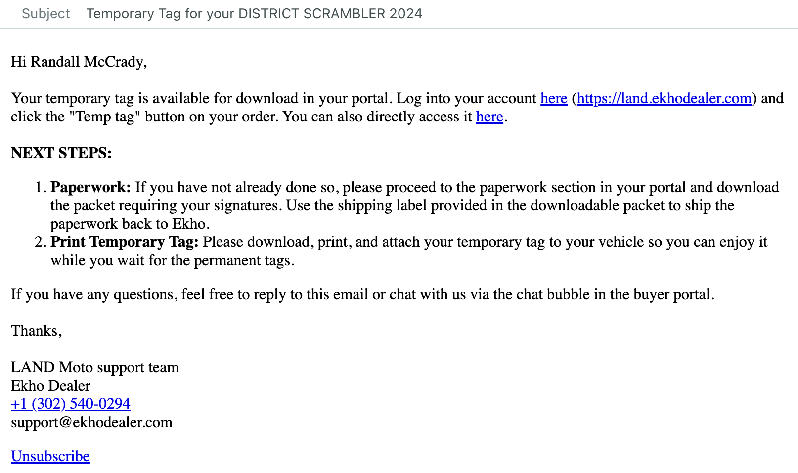
    

## Automated Re-Engagements

Ekho has built an internal infrastructure to detect outstanding actions for a given order and automatically re-engage the buyer to continue making progress with their order.

-   **Interval:** The first re-engagement is sent 6 hours after the last buyer activity. Subsequent re-engagements are sent at increasing intervals: 24 hours after the first, 48 hours after the second, and 72 hours after the third re-engagement, assuming continuous inactivity.
    {' '}
    

    	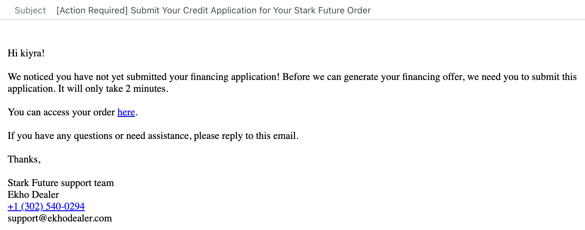
    	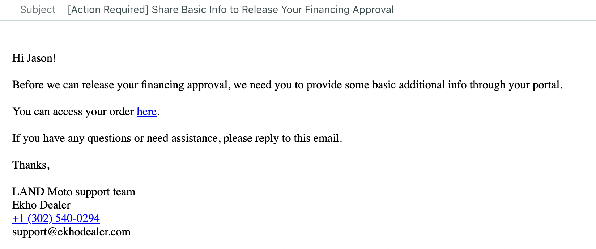
    	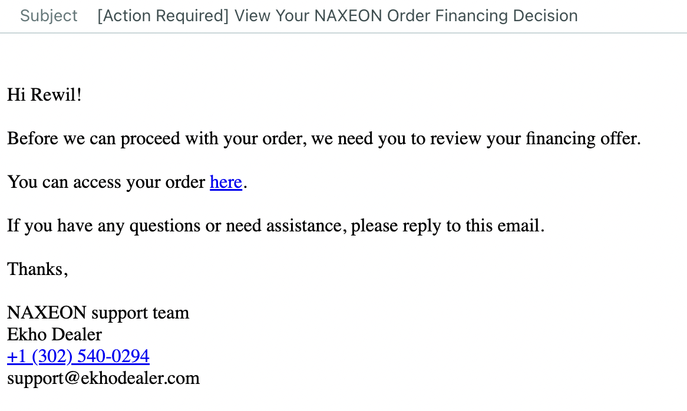
    

    

    	Images from left to right: reminder to submit financing application,
    	provide stipulation information, and make a decision on the financing
    	offer.
    

    

    	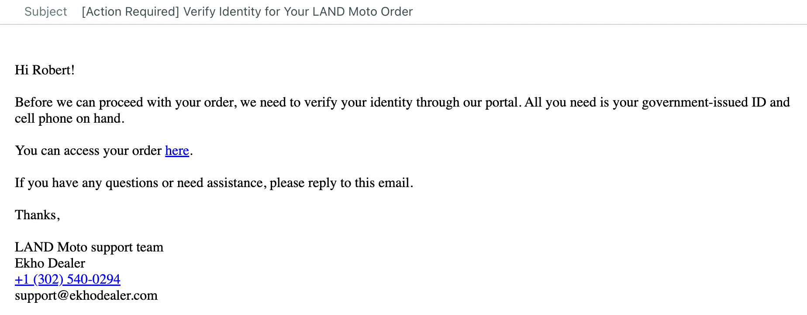
    	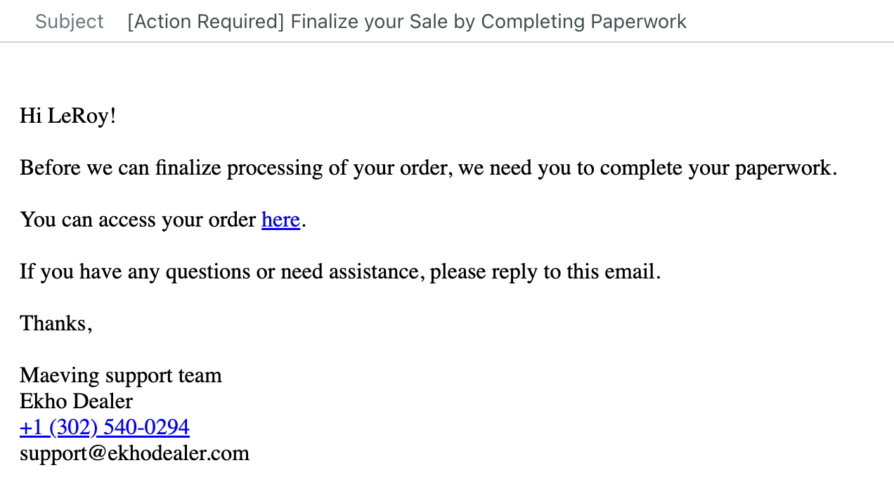
    	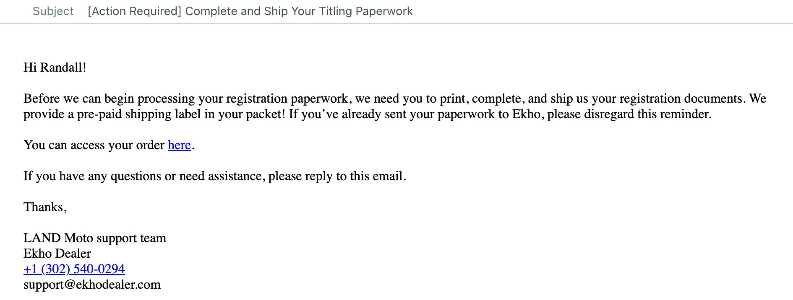
    

    

    	Images from left to right: reminder to complete identity verification,
    	sign the Bill of Sale, and ship titling paperwork.
    

