<Tip>
	The glossary of terms is sorted alphabetically by category type. To find the
	meaning of a particular term, please `CTRL+F` on this screen.
</Tip>

# Buyer Portal

#### Buyer Portal Home Page

After [Ekho Checkout](/essentials/ekho-glossary#ekho-checkout), the buyer will be redirected to their Buyer Portal. Here they will be able to view all their orders and complete action items prior to delivery.

<Frame caption='The UI of the Buyer Portal.'>
	

		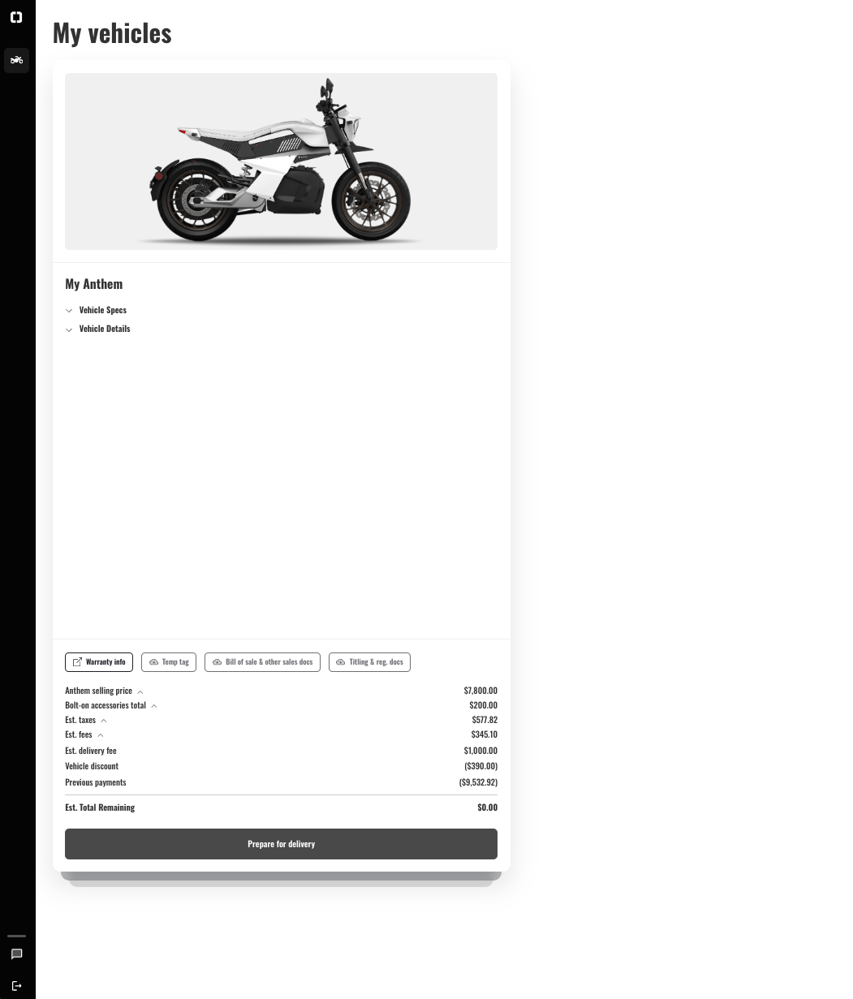
		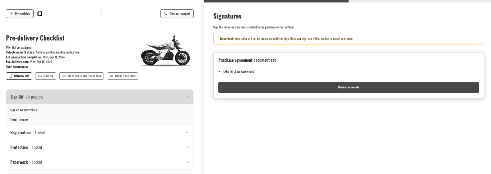
	

</Frame>

# Checkout & Placing an Order

#### Checkout Payment Selection

The payment selection a buyer selects at [Ekho Checkout](/essentials/ekho-glossary#ekho-checkout). The options can be the following:

-   **Finance**: the buyer will apply for financing at checkout.
-   **Reserve**: a deposit sufficient enough to begin order processing. The full remaining balance will be required prior to shipment. The reservation amount is configurable by the OEM and can be removed as an option if desired.
-   **Pay by card**: the buyer will pay the full balance via card.
-   **[Coming soon] Third party financing**: the buyer will bring in their own financing such as a local credit union, personal financing, etc.
-   **[Coming soon] Pay by ACH**: the buyer will pay the full balance or reservation amount via ACH / bank transfer.

#### Ekho Checkout

The UI when placing an order through Ekho's Checkout showcased below.

<Frame caption='The UI of Ekho Checkout.'>
	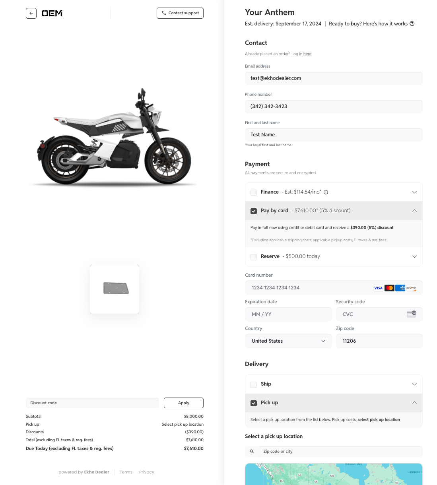
</Frame>

#### Fulfillment Selection

The fulfillment selection chosen at [Ekho Checkout](/essentials/ekho-glossary#ekho-checkout) indicating delivery to a specified address or pick up from a pre-defined list of locations provided by the OEM.

<Frame caption='The UI of selecting a pick up location or providing a delivery address at Ekho Checkout.'>
	

		
		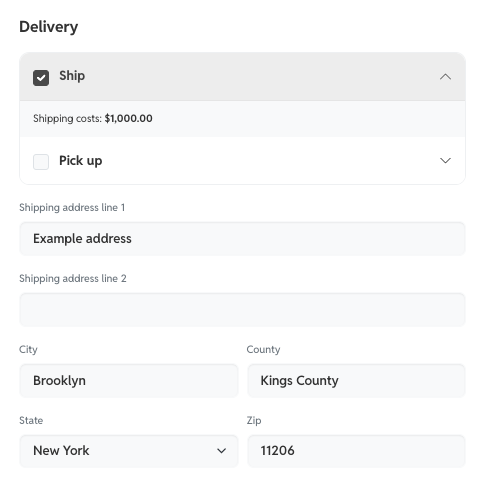
	

</Frame>

#### Pre-qualification

An interested financing buyer selects to get pre-qualified for financing at checkout. This decision will come out within seconds as either approved or needing additional information through the financing application.

<Frame caption='The UI of submitting a pre-qualification decision at Ekho Checkout.'>
	

		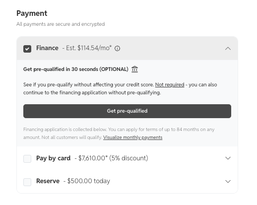
		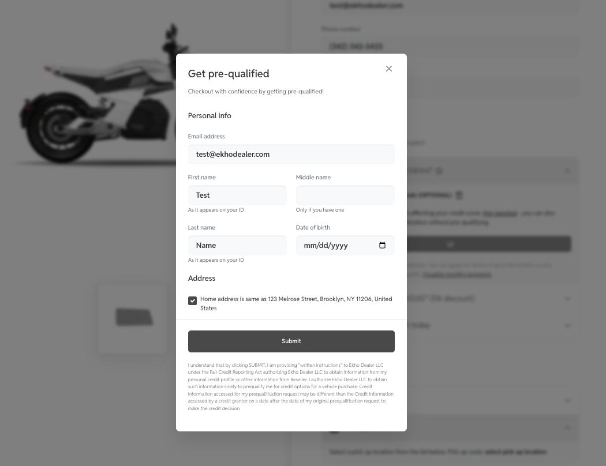
	

</Frame>

#### Registration Selection

The selection chosen at [Ekho Checkout](/essentials/ekho-glossary#ekho-checkout) indicating the titling and registration option. The available options will vary based upon the specific requirements of the registration state, vehicle type, and [Checkout Payment Selection](/essentials/ekho-glossary#checkout-payment-selection). See [Registration and Titling Options](/essentials/ekho-glossary#registration-and-titling-options) for more details.

<Frame caption='The UI of selecting the registration option(s) at Ekho Checkout.'>
	

		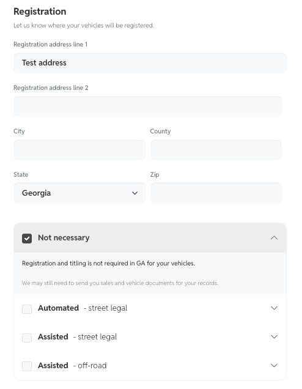
		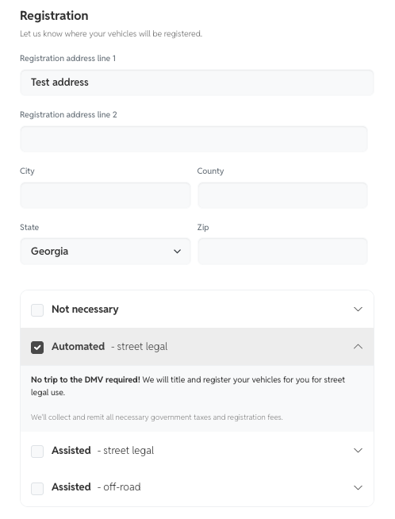
		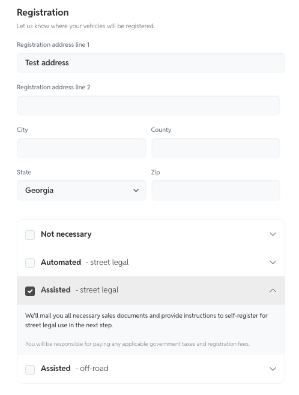
	

</Frame>

#### Submit Financing Application

The buyer will continue to the financing application and submit the application if they selected "Finance" as the [Checkout Payment Selection](/essentials/ekho-glossary#checkout-payment-selection). If a buyer selects to "Reserve" or orders more than one vehicle, they will submit the financing application in their [Buyer Portal](/essentials/ekho-glossary#buyer-portal).

<Frame caption='The UI of continuing to the financing application and ultimately submitting the application at Ekho Checkout.'>
	

		
		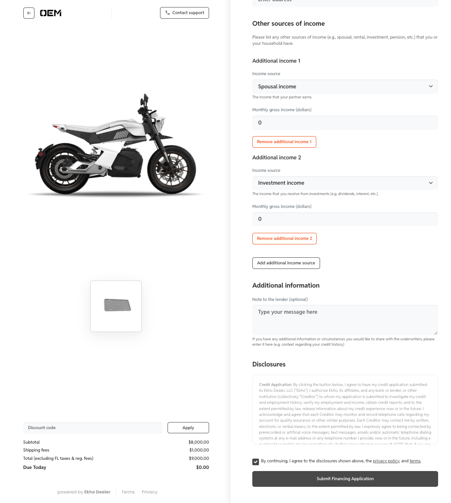
	

</Frame>

# Features

#### Abandoned Carts

View all the abandoned carts from [Ekho Checkout](/essentials/ekho-glossary#ekho-checkout) and [Ekho Preorder](/essentials/ekho-glossary#ekho-preorder). Here, you can see how many automated re-engagement emails have been sent to the buyer, copy a link to their checkout session, preview the link, and much more.

<Frame caption='The UI of Abandoned Carts in the Admin Portal.'>
	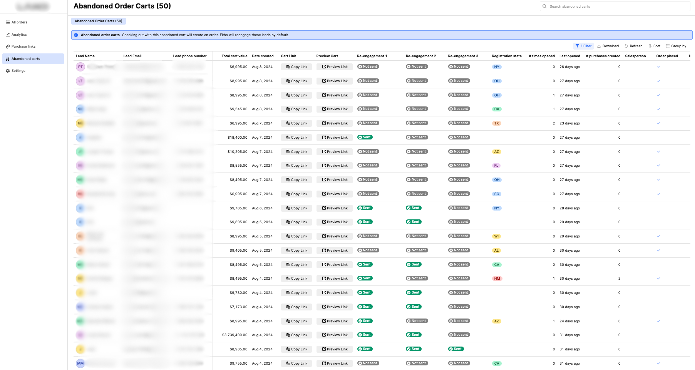
</Frame>

#### Admin Portal

The source of truth for all things Ekho for the OEM. This portal houses many of the features listed in this section, as well as taking action on orders as described in the [Vehicle Order Lifecycle](/essentials/vehicle-order-lifecycle) document.

#### Analytics

<Frame caption='Analytics in the Admin Portal.'>
	
</Frame>

#### Custom Purchase Links

Create single or multi-use checkout links to send to individual buyers, include on your website, and/or send as a CTA in marketing campaigns. Custom purchase links can have unique discounts, specs, and acessories applied.

<Frame caption='The UI of configuring a Custom Purchase Link in the Admin Portal.'>
	

		
		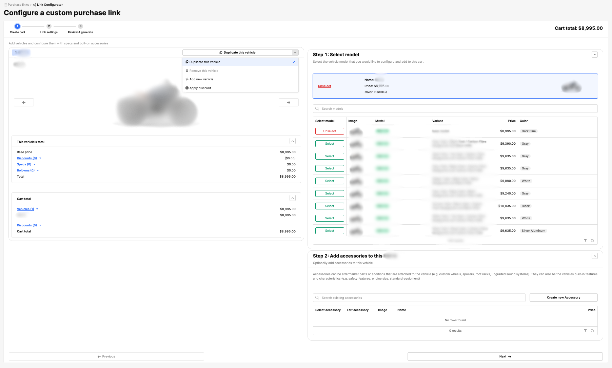
		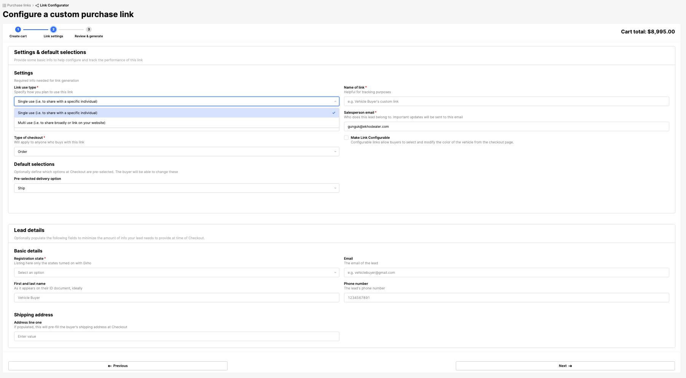
	

</Frame>

#### Discount Campaigns

Discount Campaigns can be created by the OEM to enable buyers to apply the code at checkout. Discount Campaigns can either be a fixed amount or percentage-based. Codes are active based on a defined time window and selected model(s).

#### [Coming Soon] Reports

# Financing

#### Conditional Offer

A buyer receives a conditional offer from the lender, pending additional information to clear certain stipulations. The most common stipulations requested include, but are not limited to, proof of income, residence, additional income, and personal references. When the buyer provides all the necessary documentation to clear the stipulations, they will receive a full Financing Offer.

#### Financing Offer

A buyer receives a final financing offer from the lender, either approved, counteroffered, or rejected.

#### Retail Installment Contract (RIC)

The final financing contract signed by the buyer that "locks" in the deal. Once signed, a financing order is no longer eligible for a cancellation or refund. It is important to note that the RIC is only available when the OEM marks the order as ["Ready to Ship"](essentials/vehicle-order-lifecycle#awaiting-oem-action) in the Admin Portal.

# Order Processing

#### Converted Order

An order will be "converted" once it completes all the prerequisites listed in ["Pending Orders"](/essentials/vehicle-order-lifecycle#pending-orders). At this point, the order is no longer cancelable or refundable (certain terms may apply).

#### Pending Order

Once an order is placed through Ekho Checkout, it will become a Pending Order. Please reference ["Pending Orders"](/essentials/vehicle-order-lifecycle#pending-orders) for more details on the prerequisites for an order to become a Converted Order.

# Paperwork

#### Bill of Sale

The document consummating the sale. E-signing this form is a prerequisite to kicking off fulfillment.

#### Buyer Packet

The packet of documents required to title and register a buyer's vehicle for an automated T&R order. The contents of the packet will vary based on the registration state's requirements. In a majority of cases, this packet will need to be downloaded by the buyer, wet-signed, and shipped back to Ekho using our pre-paid shipping label.

#### Manufacturer's Statement of Origin (MSO)

The MSO is a document required to title and register the vehicle. This can either be mailed to us by the OEM or Ekho can generate it with all the correct information.

#### Purchase Agreement

The binding contract for non-financed orders. Once signed, the buyer is no longer eligible for a cancelation or refund. This is signed immediately after placing an order in ["Ekho Checkout"](/essentials/ekho-glossary#ekho-checkout).

#### Temporary Tag

Ekho will provide temporary tags to all buyers at cost. They are issued and valid for up to 90 days, allowing the buyer to enjoy their vehicle right away while they wait for their final metal tags. These will be issued to the buyer near their delivery date via email.

# Payment Selection

#### Cash

The buyer has chosen to pay the balance of their order in cash closer to the delivery date. It also means that the buyer paid a reservation fee at checkout.

#### Cash Early

The buyer has selected to pay the balance of their order in cash after checkout, but in the financing (i.e. the first) section in the Buyer Portal. This either means that the buyer has paid a reservation fee at Checkout, or that they were rejected for financing and chose to pay in cash instead (this rarely happens).

#### Checkout Full Payment

The buyer has chosen to pay in full at checkout (via card).

#### Native Financing

The buyer has chosen to finance the vehicle through Ekho's in-house financing system. We've automated the process to make it as seamless as possible for the buyer and leverage different lender partners based on the `vehicleType` of the vehicle in question.

#### [Coming Soon] Other Financing

The buyer has chosen to finance the vehicle through a third-party lender. This could be a bank, credit union, or other financial institution.

# Payment Status

#### Down Payment Paid

The buyer has paid the down payment for the vehicle order. This is the first payment received for a financed order.

#### Financing Guaranteed

The financing lender is transferring the financed funds to Ekho. The funds will be transferred to the OEM within a couple business days.

#### Fully Paid

The order is fully paid. This can occur through [Checkout Full Payment](/essentials/ekho-glossary#checkout-full-payment), remaining balance paid in cases of [Cash](/essentials/ekho-glossary#cash) or [Cash Early](/essentials/ekho-glossary#cash-early), or the financed amount was received by the lender.

#### No Payments

No payments have been received for the vehicle order. Payment status is initially set to this value when the buyer selects financing at Checkout. No Payments can also be applicable for financed orders that were approved for $0 down payment.

#### Reservation Paid

The buyer has paid the reservation fee at Checkout. This is the first payment received for a cash order.

# Preorders

#### Ekho Preorder

The buyer places a preorder through Ekho's preorder UI showcased below. Note, this is a separate transaction to the order placed through ["Ekho Checkout"](/essentials/ekho-glossary#ekho-checkout) at a later time.

<Frame caption='The UI when placing an Ekho Preorder.'>
	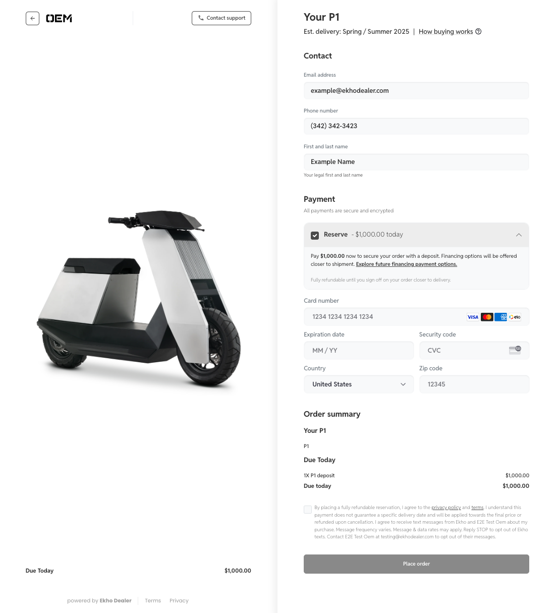
</Frame>

#### Preorder Deposit

The amount required for a buyer to secure a preorder. This fully refundable amount is configurable by the OEM and can be the full amount (exclusive of applicable taxes, fees, and delivery), a reservation amount, or both.

#### Preorder Lead Time

The text showcased on the top right indicating the estimated delivery date for the preorder placed. This copy is configurable by the OEM to a specific date or time window (i.e. December 1st, 2024, Spring 2025, etc.).

# Registration and Titling Options

<Frame caption='The UI of selecting the registration option(s) at Ekho Checkout.'>
	

		
		
		
	

</Frame>

#### Assisted

Ekho will assist the buyer with titling and registration by providing mailing the necessary documents on Ekho's end. It will be the responsibility of the buyer to pay necessary sales tax and registration fees when visiting the DMV.

#### Automated

Ekho will handle the titling and registration for the buyer, in addition to collecting the necessary sales tax and registration fees. No trips to the DMV will be required for the buyer. If an order is financing, this will be the only option available.

#### Not Necessary

Based on the vehicle type and state requirements, titling and registration is not required. If this is applicable, no other options will surface.
