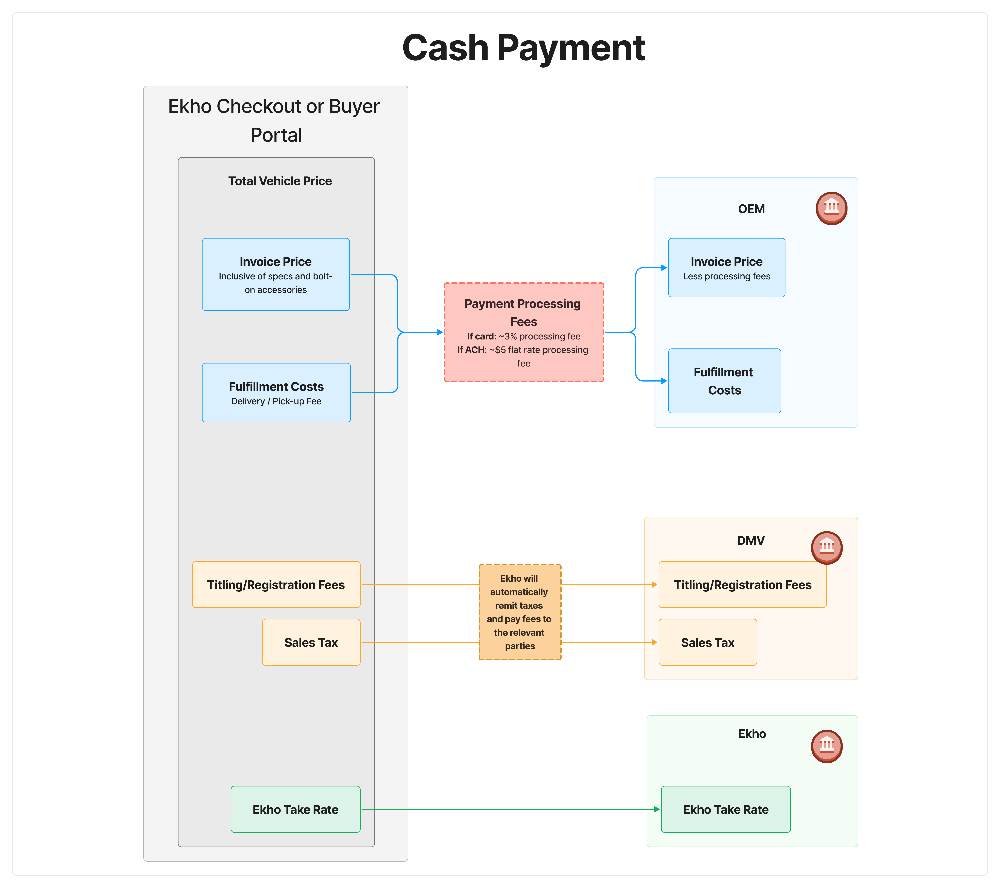

## Ekho Dealer

### Cash Payments

Cash payments can be made in two scenarios:

1. Checkout full payment
    - Can be done via card for ~3% processing fee charged to the OEM
2. Full payment in buyer portal for full balance or remaining balance
    - Can be done via card for ~3% processing fee charged to the buyer or ACH for ~$5 fee charged to the OEM

<Frame caption='Flow of funds for a cash payment.'>
	
</Frame>

### Financing Payments

Financing payments will have two payments:

1. Down payment (if applicable)
    - Can only be done via ACH for a ~$5 processing fee covered by the OEM
2. Financed amount
    - Direct debit to OEM's bank account as soon as fulfillment is ready

<Frame caption='Flow of funds for financing payments.'>
	
</Frame>
