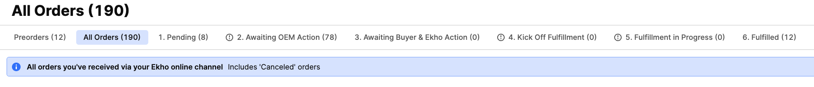
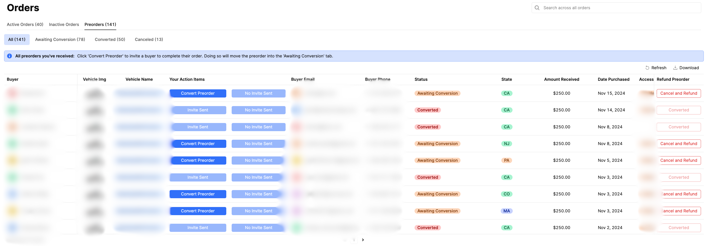
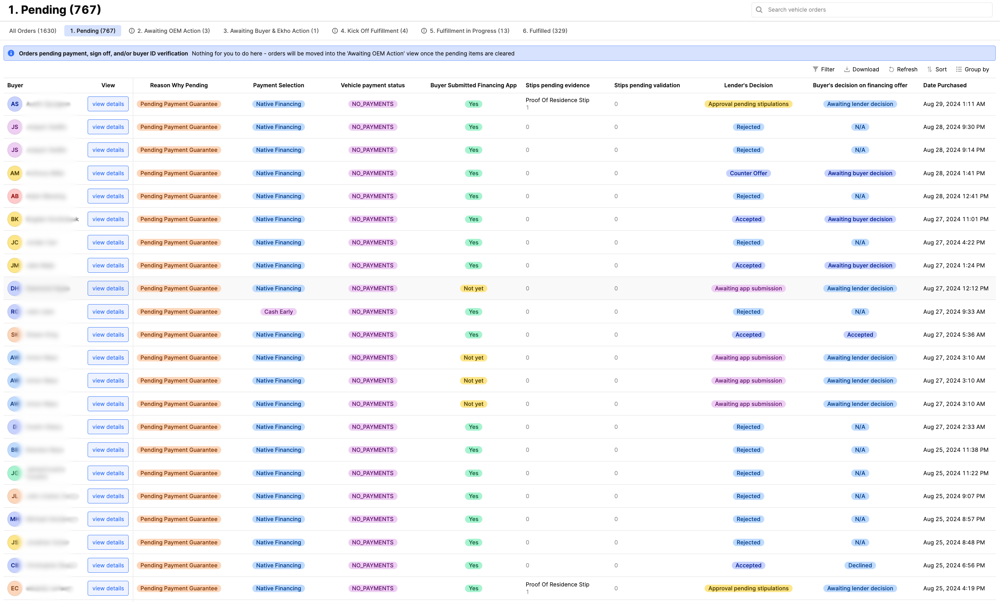
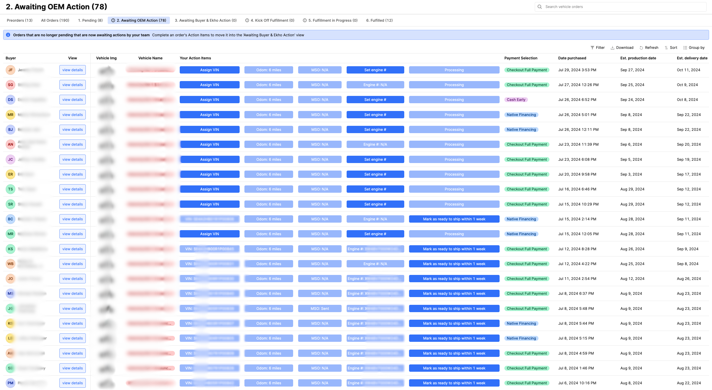
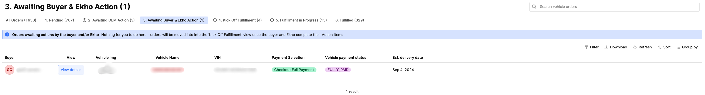
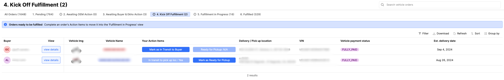
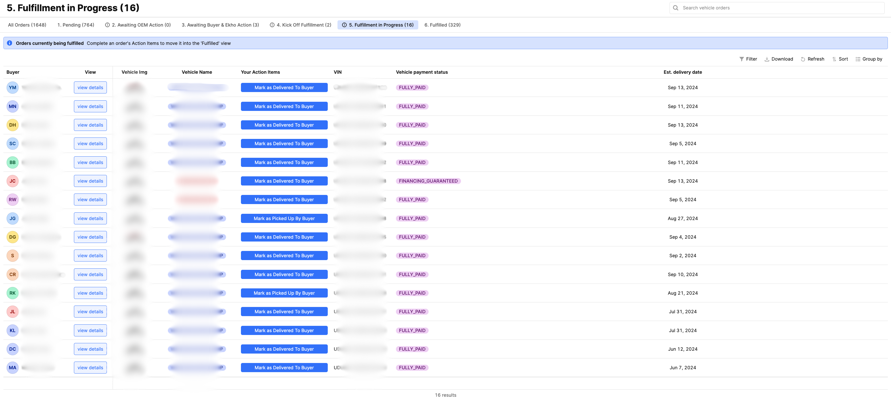
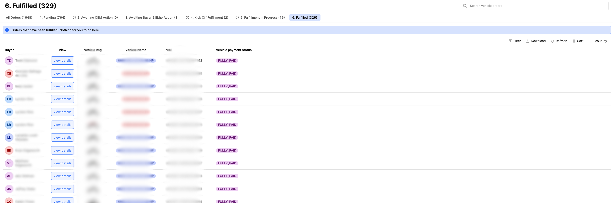

<Tip>
	This guide will closely follow the buckets indicated in the Admin Portal. As
	you review, please reference the Admin Portal to visualize how an order goes
	from one stage to the next.

    

    Toggle dark mode on the top right of the screen to increase the contrast of
    the background and images.

</Tip>

## Related Documents

<CardGroup cols={2}>
	<Card
		title='Ekho Glossary'
		icon='book-sparkles'
		href='/essentials/ekho-glossary'
	>
		Overviews terminology that is oftentimes referenced in this document,
		especially values of specific columns in a given table view in the Admin
		Portal.
	</Card>
	<Card
		title='Ekho Communications'
		icon='envelope-open-text'
		href='/essentials/ekho-communications'
	>
		Overviews email copy that is oftentimes triggered upon completion of
		certain steps Ekho, the OEM, or the buyer completes.
	</Card>
</CardGroup>

## Preorders

<Info>
	Collecting preorders will not be relevant for all OEMs. Please disregard
	this section if you are not interested in collecting preorders with Ekho.
</Info>

<Frame caption='Screenshot of the "Preorders" tab and its action buttons.'>
	
</Frame>

### Action Buttons

| Button Name       | Enabled                                                                                                 | Description                                                                                                                    | Communications to Buyer                                                      |
| :---------------- | :------------------------------------------------------------------------------------------------------ | :----------------------------------------------------------------------------------------------------------------------------- | :--------------------------------------------------------------------------- |
| Convert Preorder  | Available as a one time action                                                                          | Invites the buyer back to convert the preorder by completing checkout                                                          | Email and SMS sent to the buyer with their unique checkout link provided     |
| Preview Cart      | Available when conversion invitation has been sent out, but not yet converted (i.e. completed checkout) | Opens a pop up to either copy the shareable checkout link for the buyer or view a preview link that does not impact analytics  | N/A - but can be used to copy a shareable link to send to the buyer          |
| Cancel and Refund | Available as long as the preorder has not converted (i.e. buyer did not complete checkout)              | Cancels the preorder, initiates a refund to the buyer's original payment method, and reverses the funds transferred to the OEM | Email sent to the buyer confirming the full refund of their preorder deposit |

### Preorder Steps

<Steps>
	<Step title='Buyer Places a Preorder'>
		A buyer will appear in the "Preorders" tab once they complete their
		preorder through Ekho.
		  **-- Preorder status:** Awaiting Conversion
		  **-- Available buttons:** Convert Preorder, Cancel and Refund
	</Step>
	<Step title='Convert Preorder'>
		When you are ready to convert a preorder click the "Convert Preorder"
		button to notify the buyer. This button should be clicked when the OEM
		is ready to shortly begin production of the preorder and would like to
		invite the buyer to complete their full checkout to convert into a
		guaranteed sale. See [Ekho
		Communications](/essentials/ekho-communications#preorder-conversion) for
		email copy.
		  **-- Preorder status:** Awaiting Conversion
		  **-- Available buttons:** Preview Cart (preview link of buyer’s
		unique checkout basket), Cancel and Refund
	</Step>
	<Step title='Buyer Completes Checkout'>
		A buyer completes checkout using their unique link provided in email and
		SMS when the OEM clicks "Convert Preorder". At checkout they can select
		to either pay in full or apply for financing. It's important to note
		that conversion of a preorder does not mean the sale is guaranteed. The
		preorder is ready for OEM action only when the buyer completes all the
		steps to get their order into the ["Awaiting OEM
		Action"](/essentials/vehicle-order-lifecycle#awaiting-oem-action) tab.
		  **-- Preorder status:** Converted
		  **-- Available buttons:** N/A as the order is no longer a
		preorder
	</Step>
	<Step title='Complete!'>
		The preorder will now begin its journey from "Pending" all the way to
		"Fulfilled"!
	</Step>
</Steps>
<Info>
	**Cancellations & Refunds:** At this point, the OEM is not able to
	self-serve cancel and refund the preorder. If a converted preorder would
	like to cancel and refund (i.e. financing rejected, does not want to sign
	the binding Purchase Agreement, etc.), please reach out to Ekho, and we will
	check if their cancellation request abides by our cancellation policy.
</Info>

## Pending Orders

<Frame caption='Screenshot of the "Pending" tab and its metadata.'>
	
</Frame>

<Tabs>
	<Tab title='Financing Orders'>
		<Steps>
			<Step title='Submit Financing Application'>
				Applications are submitted either in checkout or their portal,
				depending on the selections chosen at checkout. A decision will
				usually be provided within minutes.
				  **-- Buyer Submitted Financing App:** Not yet -> Yes
				  **-- Lender's Decision:** Awaiting app submission ->
				Awaiting lender decision
			</Step>
			<Step title='Conditional Offer Received (if applicable)'>
				The lender needs additional information to release the official
				offer (i.e. proof of income, proof of residence, etc.)
				  **-- Stips pending evidence:** Will list out the stipulations
				we are still awaiting from the buyer
				  **-- Lender's Decision:** Approval pending stipulations
			</Step>
			<Step title='Make Decision on Financing Offer'>
				Once a full offer is given, the buyer will make a decision
				whether to accept or deny. If they were rejected, this step will
				be skipped.
				  **-- Lender's Decision:** Rejected, Counter Offer, or Accepted
				  **-- Buyer’s decision on financing offer:** Awaiting
				buyer decision, Accepted, or Declined
			</Step>
			<Step title='Complete Identity Verification'>
				Buyer will need to complete identity verification by providing
				the front and back of a government-issued ID. Results of
				verification will be given within seconds.
			</Step>
			<Step title='Complete!'>
				Order will move into the "Awaiting OEM Action" table.
			</Step>
		</Steps>
	</Tab>
	<Tab title='Non-financing Orders'>
		<Steps>
			<Step title='Sign Purchase Agreement'>
				The Purchase Agreement is a legally binding contract signed by
				non-financed orders. After the buyer e-signs this document, they
				are no longer eligible for a cancellation or refund.
				  **-- Reason why pending:** Pending payment guarantee -> Pending
				verification
			</Step>
			<Step title='Complete Identity Verification'>
				Buyer will need to complete identity verification by providing
				the front and back of a government-issued ID. Results of
				verification will be given within seconds.
			</Step>
			<Step title='Complete!'>
				Order will move into the "Awaiting OEM Action" table.
			</Step>
		</Steps>
	</Tab>
</Tabs>

## Awaiting OEM Action

<Info>
	**Cancellations & Refunds:** At this point, the buyer is no longer eligible
	for a cancellation and refund. Although the buyer messaging will indicate
	this, legally, a financed order is able to cancel their loan. If this is the
	case, Ekho will try our best to keep the sale alive and update the OEM if
	there are any incentives we can provide to the buyer.
</Info>

<Frame caption='Screenshot of the "Awaiting OEM Action" tab and its action buttons.'>
	
</Frame>

<Steps>
	<Step title='Assign VIN'>
		OEM will assign the VIN for each vehicle order.
	</Step>
	<Step title='Set Odometer Reading'>
		OEM will set the odometer reading for each vehicle order.   **We
		can set a default value if the OEM knows the odometer reading will
		consistently stay within a given range during pre-delivery testing.**
	</Step>
	<Step title='Send MSO'>
		OEM will mark MSO as sent to Ekho.   **We highly recommend OEMs
		allow Ekho to generate the MSOs in-house to streamline operations. In
		this case, the MSO will be marked as N/A.**
	</Step>
	<Step title='Set Motorcycle Engine Number (if applicable)'>
		OEM will set the motorcycle engine number for each vehicle order. This
		is only required for motorcycles registering in California and
		Minnesota.
	</Step>
	<Step title='Mark Ready to Ship'>
		OEM will click this button and confirm that the vehicle is ready to ship
		within a week. For financed orders, this will notify the buyer to sign
		their final financing paperwork. Once signed, the financed order is no
		longer eligible for a cancellation or refund.
	</Step>
	<Step title='Complete!'>
		Order will move into either the "Awaiting Buyer & Ekho Action" or "Kick
		Off Fulfillment" table depending on the status of the order. Please
		reference the section below for more details.
	</Step>
</Steps>

## Awaiting Buyer & Ekho Action (if applicable)

<Info>
	It is our utmost priority at Ekho to keep the number of orders in this
	section as low as possible by proactively providing assistance to buyers.
</Info>

<Frame caption='Screenshot of the "Awaiting Buyer & Ekho Action" tab and its metadata.'>
	
</Frame>

### Reasons Why an Order Can Be in "Awaiting Buyer & Ekho Action"

For all the cases below, Ekho has set up automated re-engagements via email and SMS to ensure buyers complete these in a timely manner. See
[Ekho Communications](/essentials/ekho-communications#automated-re-engagements) for email copy.

<Steps>
	<Step title='Awaiting Full Payment'>
		A non-financed order is still pending payment of the full balance. This
		will oftentimes be due to an ACH transfer currently processing, which
		usually takes 3-5 business days.
	</Step>
	<Step title='Awaiting Insurance Proof'>
		Financed orders and certain states require proof of insurance. Ekho will
		be sure to support buyers in securing a policy with the correct
		requirements.
	</Step>
	<Step title='Awaiting Signatures on Final Financing Paperwork'>
		Ekho is awaiting signatures from the buyer on their final financing
		paperwork (which was made available after the OEM marked the order as
		ready to be shipped).
	</Step>
	<Step title='Awaiting Signatures on Bill of Sale'>
		Ekho is awaiting signatures on the Bill of Sale, which officially
		consummates the sale, for non-financed orders.
	</Step>
</Steps>

## Kick Off Fulfillment

<Frame caption='Screenshot of the "Kick Off Fulfillment" tab and its action buttons.'>
	
</Frame>

<Info>
	**Cancellations & Refunds:** At this point, all financing orders are no
	longer eligible for cancellation or refund as they have signed the binding
	financing contract in the previous step to move from "Awaiting Buyer & Ekho
	Action" to "Kick Off Fulfillment."
</Info>

<Tabs>
	<Tab title='Direct Delivery'>
		<Steps>
			<Step title='Mark as in Transit to Buyer'>
				Click the "Mark as in Transit to Buyer" button to confirm
				fulfillment has begun. OEM will have the opportunity to update
				the delivery date at this point.
			</Step>
			<Step title='Complete!'>
				Order will move into the "Fulfillment in Progress" table.
			</Step>
		</Steps>
	</Tab>
	<Tab title='Pickup'>
		<Steps>
			<Step title='Mark as in Transit to Pickup Location'>
				Click the "Mark as in Transit to Pickup Loc." button to confirm
				fulfillment has begun. OEM will have the opportunity to update
				the delivery date at this point.
			</Step>
			<Step title='Mark as Ready for Pickup'>
				Click the "Mark as Ready for Pickup" button to confirm the buyer
				can pick up their vehicle from their selected pickup location.
			</Step>
			<Step title='Complete!'>
				Order will move into the "Fulfillment in Progress" table.
			</Step>
		</Steps>
	</Tab>
</Tabs>

## Fulfillment in Progress

<Frame caption='Screenshot of the "Fulfillment in Progress" tab and its action button.'>
	
</Frame>

<Steps>
	<Step title='Mark as Delivered or Picked Up By Buyer'>
		Click the "Mark as Delivered To Buyer" or "Marked as Picked Up By Buyer"
		button based on the delivery option the buyer selected at checkout.
	</Step>
	<Step title='Complete!'>Order will move into the "Fulfilled" table.</Step>
</Steps>

## Fulfilled

<Frame caption='Screenshot of the "Fulfilled" tab and its metadata.'>
	
</Frame>

This table will showcase all the fulfilled orders.
