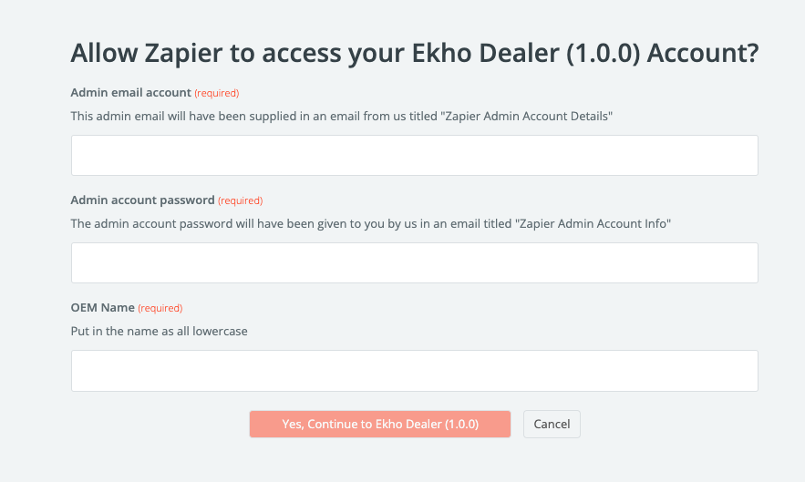
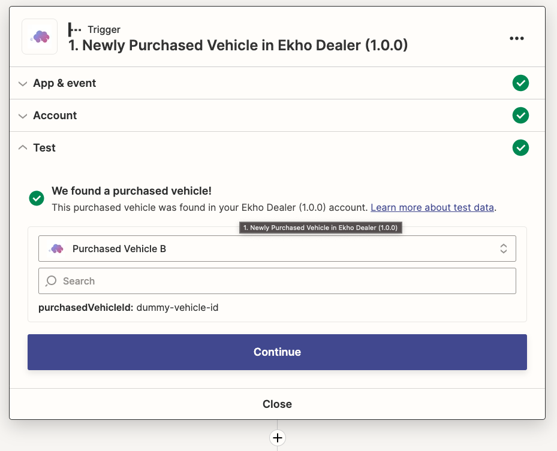

## What is Zapier?

### Overview

Zapier is a no-code product that allows end users, like you, to integrate with web applications, like Ekho Dealer. Ekho Dealer uses Zapier to make it easy for us to transfer order data back to you.

### What is a Zapier action?

Zapier Actions allow people to write new data to cloud-based apps. In the case of Ekho Dealer, our Zapier actions allow you to provide our app with updates regarding vehicle status and VIN assignments.

### What is a Zapier trigger?

A Zapier Trigger is an event in Zapier that fires when new data from an API arrives. The Zapier trigger parses the incoming data payload’s individual data fields, and lets users include that data in subsequent Zap action steps.

### What is a Zapier zap?

Zapier zaps are a sequence of Zapier actions that are kicked off by a single Zapier trigger.

## Relevant Ekho Dealer Actions

Below are all the relevant Ekho Dealer actions on Zapier to help with data transfer.

### Fetch Purchased Vehicle Data

**What does this action do:** fetches a `Purchased Vehicle` from Ekho Dealer’s database

**What data does the action require:** `Purchased Vehicle ID` (the Ekho Dealer ID of the `Purchased Vehicle` you want to fetch)

**What data does this action return:** the `Purchased Vehicle` with the relevant data properties

### Fetch Buyer Data

**What does this action do:** fetches a `Buyer` from Ekho Dealer’s database

**What data does the action require:** `Buyer ID` (the Ekho Dealer ID of the `Buyer` you want to fetch)

**What data does this action return:** the `Buyer` with the relevant data properties

### Fetch Purchased Accessory Data

**What does this action do:** fetches a `Purchased Accessory` from Ekho Dealer’s database

**What data does the action require:** `Purchased Accessory ID` (the Ekho Dealer ID of the `Purchased Accessory` you want to fetch)

**What data does this action return:** the `Purchased Accessory` with the relevant data properties

### Fetch Placed Order Data

**What does this action do:** fetches a `Placed Order` from Ekho Dealer’s database

**What data does the action require:** `Placed Order ID` (the Ekho Dealer ID of the `Placed Order` you want to fetch)

**What data does this action return:** the `Placed Order` with the relevant data properties

## Ekho Dealer Triggers

Below are all the Ekho Dealer triggers you have at your disposal on Zapier. You are free to create other zaps that leverage these triggers in whichever ways you like (e.g. creating a new item in your ERP system every time a Newly Purchased Vehicle trigger is fired). Don’t, however, use these triggers to create new orders in your e-commerce site; we already do this automatically.

### Newly Purchased Vehicle

**When does this trigger fire:** when a new vehicle is purchased via your checkout page

**What data gets sent to this trigger:** `purchasedVehicleId` (the ID of the Ekho Dealer `Purchased Vehicle`)

**Notes:** if you’re interested in accessing the properties of the `Purchased Vehicle` object, use the ["Fetch Purchased Vehicle Data"](/essentials/zapier-integration#fetch-purchased-vehicle-data) action by providing it with the `purchasedVehicleId` from this trigger

### Newly Purchased Accessory

**When does this trigger fire:** when a new accessory (i.e. a product that isn’t a vehicle) is purchased via the checkout page

**What data gets sent to this trigger:** `purchasedAccessoryId` (the ID of the Ekho Dealer `Purchased Accessory`)

**Notes:** if you’re interested in accessing the properties of the `Purchased Accessory` object, use the ["Fetch Purchased Accessory Data"](/essentials/zapier-integration#fetch-purchased-accessory-data) action by providing it with the `purchasedAccessoryId` from this trigger

### Newly Placed Order

**When does this trigger fire:** when a new order is placed via the checkout page.

**What data gets sent to this trigger:** `placedOrderId` (the ID of the Ekho Dealer `Placed Order`)

**Notes:** if you’re interested in accessing the properties of the `Placed Order` object, use the ["Fetch Placed Order Data"](/essentials/zapier-integration#fetch-placed-order-data) action by providing it with the `placedOrderId` from this trigger

###New Vehicle Payment Status Trigger

**When does this trigger fire:** triggers whenever a vehicle payment status is updated. Three possible update values:

-   `RESERVATION_PAID` : when the reservation payment succeeds
-   `FINANCING_GUARANTEED` : when the buyer has accepted and loan and terms are locked in
-   `FULLY_PAID` : when we've received all of the funds for this vehicle (either when they pay in full in cash or we received funding from the lender)

**What data gets set to this trigger:**

-   `updatedVehiclePaymentStatus` : the new vehicle payment status
-   `purchasedVehicleId` : the Ekho Dealer ID of the `Purchased Vehicle`

## Using the Ekho Dealer Integration in Zapier

### Creating a Zap using an Ekho Dealer Trigger

<Info>
	In the below example, we show you how to start creating a Zap that is
	triggered by a newly purchased vehicle being created. **Note:** this trigger
	only returns an ID. If you want to use vehicle data (rather than just the
	vehicle id), it will be important to add Ekho actions in subsequent Zap
	steps such as `Fetch Purchased Vehicle Data` (using vehicle ID as input) and
	`Fetch Buyer Data` (using buyerId as input fetched from the output of `Fetch
	Purchased Vehicle Data`)
</Info>
1. From your Zapier account, create a Zap with `Ekho Dealer’s Newly Purchased Vehicle
Trigger`
<Frame>
	
</Frame>
2. On the account section, click ‘Sign In’
<Frame>
	
</Frame>

3. Fill in the admin email account,
   account password, and OEM name that were all generated during the onboarding process.
   This information will have been sent to you in an email titled **‘[Important] Your
   Ekho Dealer Credentials’** from us.

    {' '}
    <Frame>
    	
    </Frame>

4. Make sure you test the trigger. If the test fails, reach out to use for support. You should see something similar to the below screenshot

    <Frame>
    	
    </Frame>

5. Use this purchased vehicle id to inform future Zap actions (like Fetch Purchased Vehicle Data)!
