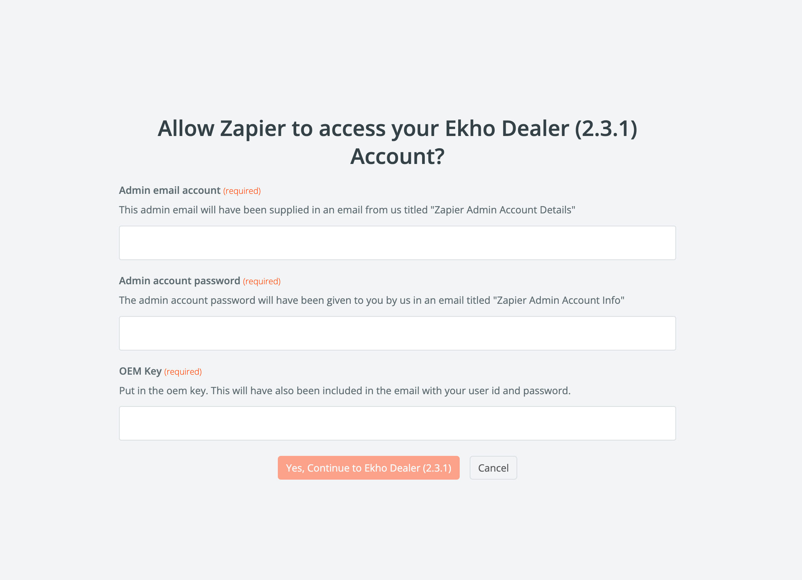
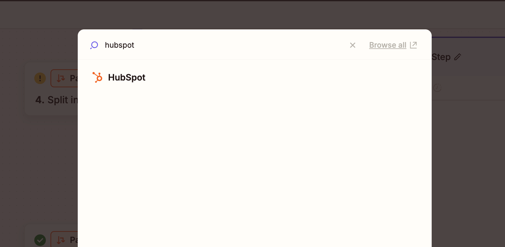

## Overview

Before you begin, it is important to understand the following:

- An abandoned cart is **created** EVERY TIME a buyer fills in ONLY their email address on the checkout page.
- An abandoned cart is **updated** EVERY TIME a buyer fills out any field on the checkout page, e.g. name, shipping address, etc.
- Each field update triggers the `Update Abandoned Cart` trigger. This means the trigger will fire A LOT of times until the buyer completes the checkout process.
- An abandoned cart is LATER **closed** IF the buyer completes the checkout process. Otherwise, it remains as an `Abandoned Cart` indefinitely.

There are two triggers that you can use to listen to abandoned carts:

1. [`New Abandoned Cart`](/guides/zapier/triggers#new-abandoned-cart): Triggers when a new abandoned cart is created. Returns the `cartId` of the abandoned cart.
2. [`Update Abandoned Cart`](/guides/zapier/triggers#update-abandoned-cart): Triggers when an abandoned cart is updated. Returns the `cartId` of the abandoned cart.

There is also an action that you can use to fetch the data of an abandoned cart:

1. [`Fetch Abandoned Cart Data`](/guides/zapier/actions#fetch-abandoned-cart-data): Fetches the data of an abandoned cart.

## Implementation

With this understanding, let's now implement the logic to listen to abandoned carts. Since we don't want to listen to every single field update, we will only use the `New Abandoned Cart` trigger to listen for new abandoned carts, wait a specific amount of time for the buyer to finish filling out the checkout form, and then use the `Fetch Abandoned Cart Data` action to fetch the data of the abandoned cart.

<Steps>
    <Step title="Create a Zap">
        From your Zapier account, create a Zap with Ekho Dealer’s `New Abandoned Cart` trigger.
        <Frame>
            
        </Frame>
    </Step>
    <Step title="Connect Account">
        On the account section, click `Select an account` and then click `Connect Account`.
        <Frame>
            
        </Frame>
    </Step>
    <Step title="Fill in the credentials">
        Fill in the `admin email account`, `account password`, and `OEM name` that were all generated during the onboarding process.
        This information will have been sent to you in an email titled **‘[Important] Your
        Ekho Dealer Credentials’** from us.
        <Frame>
            
        </Frame>
    </Step>
    <Step title="Test the trigger">
        Make sure you test the trigger. If the test fails, reach out to use for support. You should see something similar to the below screenshot:
        <Frame>
            
        </Frame>
    </Step>
    <Step title="Add a delay">
        Add a delay to give the buyer enough time to fill out the checkout form:
        <Frame>
            
        </Frame>
        For this example, we will use a delay of 10 minutes:
        <Frame>
            
        </Frame>
        Test the action. You should see something similar to the below screenshot:
        <Frame>
            
        </Frame>
    </Step>
    <Step title="Fetch the abandoned cart data">
        Add the `Fetch Abandoned Cart Data` action to fetch the data of the abandoned cart.
        <Frame>
            
        </Frame>
        Select the `cartId` from the dropdown.
        <Frame>
            
        </Frame>
        Test the action. You should see something similar to the below screenshot:
        <Frame>
            
        </Frame>
    </Step>
    <Step title="Create a Path (If Else)">
        Create a path (if else) to check if the cart was converted or if it is still abandoned.
        <Frame>
            
        </Frame>
        We only need one path, so delete the other path.
        <Frame>
            
        </Frame>
        Add a condition to check if the cart is still abandoned. Select `isDisabled` as the field:
        <Frame>
            
        </Frame>
        Select `true` as the value:
        <Frame>
            
        </Frame>
        Test the action. You should see something similar to the below screenshot:
        <Frame>
            
        </Frame>
    </Step>
    <Step title="Call To Action">
        You can now do something with the abandoned cart data. For example, send a follow up email to the buyer, save to hubspot, etc.
        <Frame>
            
        </Frame>
        **Note:** You can get the buyer information from the `Fetch Abandoned Cart Data` action. Example fields include: `email address`, `name`, `phone number`, etc.
        <Frame>
            
        </Frame>
    </Step>
    <Step title="Publish the Zap">
        When you are ready to publish the Zap, click `Publish` and then click `Publish Zap`.

        Congratulations! You have successfully created a Zap that listens to abandoned carts & executes a call to action 🎉
    </Step>
</Steps>
